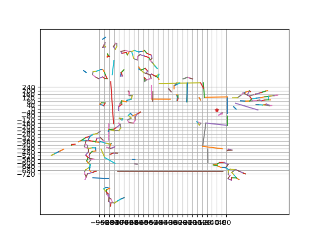

# 背景/目的

お掃除ロボット欲しい。どうせならハックしたい。

# 必要なもの

BESTEK製MAPi、ネットワーク、IPアドレス、Python

# 感想

この価格で、この機能・・・！！

tcpdump等でパケット解析すれば、もっとコマンドが見つかるのでしょうか・・・（やり方を勉強中）



# 2019.9.21　追記

動作しないようだ… IP or Portがかわっている…？

スマホアプリからMAPiを操作＋WireSharkでパケット解析したものの、原因不明…
